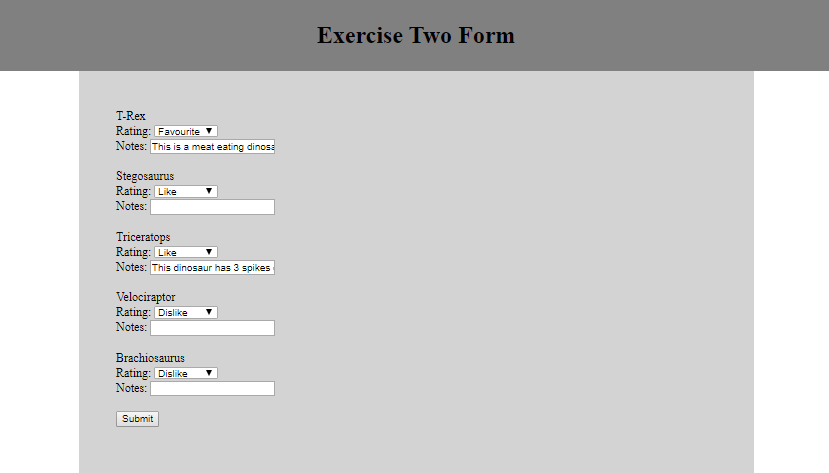
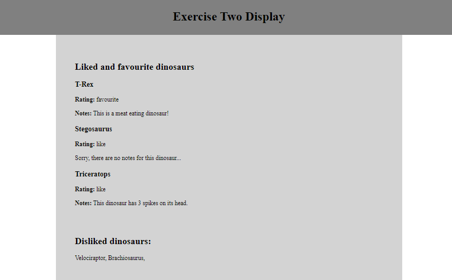

# Task Three 

# Question One 

Question one uses an HTML form within the `'dinosaur-form.jsp'` file. 
Complete a Servlet, Java object (JavaBean) and JSP page to display the information submitted from the form. 

This is what the form should look like when it is opened in the web browser: 

## 1A) Dinosaur JavaBean (5 marks)

Complete the JavaBean `'Dinosaur'` so that it can encapsulate the name, rating and 
notes about an individual dinosaur submitted in the dinosaur form `'dinosaur-form.jsp'`.

Study the form in the `'dinosaur-form.jsp'` file so that you understand the data that will be submitted with the form.

The form has a hidden input field for the dinosaur name, a drop-down list for the rating and an text input field for notes. The
data in the value attribute of a hidden input field can be accessed the same way as accessing values in normal text input. 

The name, rating and notes properties of the Dinosaur object can all be strings. 

You should check that the Dinosaur class meets the requirements of a JavaBean but remember to add any constructors you may need.

## 1B) Dinosaur Servlet (10 marks)
This activity will be completed within the 'LikesSubmission' servlet.

Complete the `'LikesSubmission'` servlet so that it uses the parameters from the submitted form to create a list/array of Dinosaur objects and sets a request attribute
that contains the list/array of Dinosaur objects.
Examine the form carefully to see what servlet method you should use. 

You should look carefully at the attributes of the form elements to work out how to access the request parameters from the form.

Suggested steps:

- In the servlet, use the request parameters to get the names, ratings and notes of all dinosaurs from the form and store them within appropriate data types in the servlet
- Create a list/array of Dinosaur objects by looping through the data 
- Setup any request attribute/s required for your JSP page 
- Pass control to the JSP page `'dinosaur-summary.jsp'` 

Tip: You should make sure to test and debug while you code; remember that you can use 'System Out' from within the servlet.  

## 1C) JSP: Displaying Data (10 marks)

In this activity you will complete the 'dinosaur-summary.jsp' so that it displays the data about the dinosaurs according to the criteria
outlined below. 

You may want to break this task into smaller steps so that you can test smaller steps; for example: accessing basic properties of Dinosaur objects within the JSP. 

You should read the criteria below carefully and think of what JSP/JSTL/EL code and control structures are most suited to the task.   

The JSP page should display the data according to these criteria: 
- Under the `'Liked and favourite dinosaurs'` heading, if a dinosaur has a rating of like or favourite the name, rating and notes of each dinosaur 
should be displayed
- Dinosaurs with a rating of `'dislike'` should not be displayed under the `'Liked and favourite dinosaurs'` 
- If no note was entered in the form for an individual dinosaur, it should display `'Sorry, there are no notes for this dinosaur...'`
- Only the names of dinosaurs with a rating of `'dislike'` should be displayed under the disliked dinosaurs heading 

The page should display something like this:
 

# Question Two

In this activity you will create an AJAX endpoint (a servlet that sends a JSON string as a response) to send a list of biography objects and then the required HTML, CSS and JS to display the data in an HTML page. 

This will involve creating the code in the servlet and the associated client side code - HTML, CSS & JS - to display the biographies in a web page. 

## 2A) AJAX Endpoint 

In the `BioServlet`, use the classes in the `exercise2` Package to write the necessary code to get a list of biography objects and send them as a JSON string.

## 2C) HTML & JavaScript

In the `exercise2` JavaScript and HTML files, write the necessary code to generate an AJAX/Fetch request to the `BioServlet` endpoint and display the content in the HTML page. You should write the code in so that if more data is added to the `BioDataAccess` class on the server side it will still be displayed appropriately in the HTML file. This will involve using the JSONResponse class included in this project; remember that you may need to copy this class or write your own if you want to use it in any other projects that may not have it included already. 

The the individual biographies in the HTML page, the name should be displayed with an `h2` element, the age and biography should be displayed within paragraph elements or similar. 

HINT: If you are not sure how to make a servlet that sends JSON strings, have a look at the servlets lab
